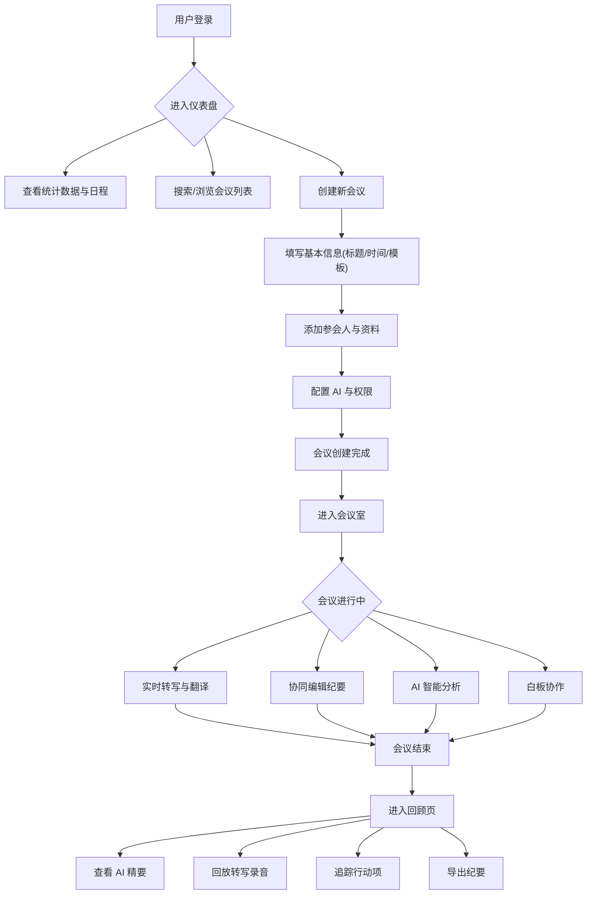

## 1. 产品概述

一款面向专业团队的 AI 智能会议助手 Web 应用，提供从会议创建、实时转写与翻译、协同纪要编辑、AI 智能分析到会后回顾的全流程解决方案。
- 核心解决痛点：会议信息碎片化、纪要整理耗时、决策追溯困难、多语言沟通障碍
- 目标用户：需要高频开会的产品/研发/管理团队，跨时区/多语言协作团队
- 产品价值：通过 AI 能力将会议效率提升 50%+，让参会者专注于讨论本身而非记录

## 2. 核心功能

### 2.1 用户角色

| 角色 | 注册方式 | 核心权限 |
|------|----------|----------|
| 团队成员 | 邮箱注册/邀请 | 创建和参与会议、查看纪要、管理个人设置 |
| 团队管理员 | 邮箱注册 | 成员管理、敏感词库配置、集成授权、查看用量 |

### 2.2 功能模块

1. **仪表盘**：全局概览，包含快捷操作、数据统计、即将召开会议、行动项追踪、趋势图表
2. **会议列表**：所有会议的搜索、筛选、批量管理，支持列表/卡片视图切换
3. **创建/编辑会议**：步骤向导式创建，包含基本信息、参会人、AI 权限设置
4. **会议室（实时核心）**：实时转写字幕、协同纪要编辑器、材料白板、AI 智能面板
5. **会议回顾**：录音回放与转写同步滚动、AI 精要、行动项看板
6. **全局搜索**：Command+K 快捷搜索，结果跨会议/转写/行动项
7. **设置**：个人偏好、团队管理、集成配置

### 2.3 页面详情

| 页面名称 | 模块名称 | 功能描述 |
|----------|----------|----------|
| 仪表盘 | 问候与快捷操作 | 根据时段问候，提供"即时会议""预约新会议"快捷入口 |
| 仪表盘 | 数据卡片行 | 今日会议数、本周总时长、待办行动项、发言活跃度四项指标 |
| 仪表盘 | 即将召开时间线 | 展示即将开始的会议列表，含 AI 预提问气泡 |
| 仪表盘 | 会后行动项卡片 | 待完成的行动项卡片流，支持勾选完成 |
| 仪表盘 | 趋势迷你图 | 近 7 天会议时长与情绪变化趋势图 |
| 会议列表 | 搜索与筛选 | 支持按关键词、状态、时间范围、参会人筛选 |
| 会议列表 | 视图切换 | 列表模式和卡片模式两种视图 |
| 会议列表 | 批量操作 | 勾选后出现底部操作栏，支持批量操作 |
| 创建会议 | 步骤向导 | 三步向导：基本信息→参会人与资源→AI 与权限设置 |
| 创建会议 | 智能建议浮窗 | 检测相似历史会议时推送关联与快捷填充 |
| 会议室 | 顶部控制栏 | 会议标题、录制红点、计时器、音源电平表、语音波纹头像、分享/结束 |
| 会议室 | 实时转写与字幕 | 说话人气泡流，不同颜色区分，支持翻译、书签、关键词高亮 |
| 会议室 | 协同纪要编辑器 | 基于 Yjs 的富文本协作，AI 磁吸卡片，多人彩色光标 |
| 会议室 | 材料与白板 | PDF/PPT 在线预览，集成白板工具，AI 截图识别 |
| 会议室 | AI 面板 | 对话流+预置指令卡片，情绪/语速仪表，被动推送提醒 |
| 会议室 | 左侧工具栏 | 议程进度条、书签时间线、参会者列表 |
| 会议回顾 | 英雄区 | 会议信息总览，播放/导出/分享操作 |
| 会议回顾 | AI 精要 | 分段摘要、关键词标签云、决策记录 |
| 会议回顾 | 转写回放 | 音频波形+转写文本同步高亮滚动，点击跳转 |
| 会议回顾 | 行动项看板 | 拖拽状态管理，关联转写证据，外部工具同步 |
| 全局搜索 | 搜索面板 | Command+K 唤起，结果分组展示 |
| 全局搜索 | AI 总结卡片 | 顶部 AI 总结含引用源 |
| 设置 | 个人设置 | 头像、默认语言、主题、字幕样式 |
| 设置 | 团队设置 | 成员角色、敏感词库、术语表、摘要风格、集成授权、用量 |

## 3. 核心流程

## 4. 用户界面设计

### 4.1 设计风格

- **设计语言**：专业、高效的 AI 工作伙伴，沉浸式会议体验
- **主色调**：靛蓝 `#4F46E5` 到紫罗兰 `#7C3AED` 渐变
- **功能色**：成功绿 `#10B981`、警告琥珀 `#F59E0B`、风险红 `#EF4444`、信息天蓝 `#3B82F6`
- **中性色（浅色）**：背景 `#F8FAFC`、卡片 `#FFFFFF`、分割线 `#E2E8F0`、一级文本 `#1E293B`
- **中性色（深色）**：背景 `#0F172A`、卡片 `#1E293B`、分割线 `#334155`、文本 `#F1F5F9`
- **AI 内容风格**：极淡紫蓝渐变背景，左侧 3px 紫色竖条，星云紫 `#6D28D9` 标识
- **字体**：主字体 Inter，等宽字体 JetBrains Mono
- **字号**：核心 16px，标题 24/20/18px，数据字体 weight 700
- **圆角**：卡片 12px、按钮/输入框 8px、模态框 16px
- **阴影**：sm（默认）、md（悬浮）、lg（模态）、glow（AI 卡片外发光）
- **玻璃态**：`backdrop-filter: blur(12px)` 半透明效果
- **图标风格**：线性图标，1.5px 线条，20px 常用尺寸
- **动效**：`cubic-bezier(0.4,0,0.2,1)` 过渡，入场渐显上移 200ms
- **布局风格**：卡片式布局，侧边栏主导航，内容区留白充足
- **响应式**：桌面优先，平板折叠侧边栏，手机底部标签栏

### 4.2 页面设计概览

| 页面名称 | 模块名称 | UI 元素 |
|----------|----------|---------|
| 仪表盘 | 问候区 | 大标题文本+快捷按钮组，渐变主色按钮 |
| 仪表盘 | 数据卡片 | 白色圆角卡片，图标+数值+标签，hover 阴影提升 |
| 仪表盘 | 双栏布局 | 左栏时间线列表+AI 气泡，右栏行动项卡片流 |
| 仪表盘 | 趋势图 | 迷你折线图，渐变填充面积 |
| 会议列表 | 搜索栏 | 输入框+下拉筛选器+视图切换图标按钮 |
| 会议列表 | 列表行 | 标题/时间/时长/参会人头像/摘要/状态标签 |
| 会议列表 | 卡片 | 封面色条+摘要+行动项计数徽标 |
| 创建会议 | 步骤向导 | 顶部步骤指示器+表单内容区+底部操作按钮 |
| 创建会议 | 参会人选择 | 头像筹码组件，可搜索添加 |
| 创建会议 | 文件上传 | 拖拽区域，文件列表带进度 |
| 会议室 | 实时转写 | 说话人气泡流，不同颜色区分，关键词高亮 |
| 会议室 | AI 面板 | 对话气泡+预置指令卡片网格+顶部仪表 |
| 会议室 | 协作编辑器 | 富文本编辑区，多人光标指示器 |
| 会议室 | 白板 | 绘图工具栏+无限画布 |
| 会议回顾 | 英雄区 | 会议标题/时间/参与人卡片，按钮组 |
| 会议回顾 | 转写回放 | 波形图+同步高亮文本，点击跳转 |
| 会议回顾 | 行动项看板 | 拖拽列（待办/进行中/已完成） |
| 全局搜索 | 搜索面板 | 模态框+搜索输入+结果分组列表 |
| 设置 | 表单 | 分段表单+开关/选择器/输入框 |

### 4.3 响应式设计

- **≥1024px**：完整 240px 侧边栏 + 顶部栏 + 内容区
- **768-1023px**：侧边栏自动折叠为 64px 图标模式，悬停展开
- **<768px**：底部标签栏导航替代侧边栏，内容区单栏布局，弹出层替代侧栏

### 4.4 可访问性

- 对比度满足 WCAG 2.1 AA 标准
- 所有交互元素有 2px 主色聚焦环
- 动态内容使用 `aria-live` 区域
- 完整键盘操作支持（Tab/Enter/Esc/焦点捕获）