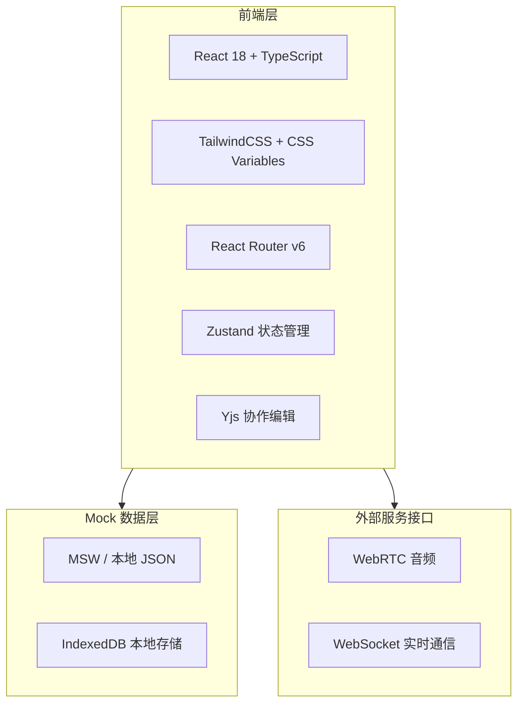
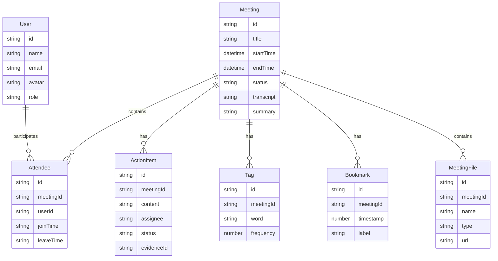

## 1. 架构设计



## 2. 技术选型说明

- **前端框架**：React 18 + TypeScript + Vite
- **样式方案**：TailwindCSS 3 + CSS Variables 主题系统
- **路由**：React Router v6，按页面模块划分
- **状态管理**：Zustand（轻量、TypeScript 友好）
- **协作编辑**：Yjs + y-prosemirror（实时协同编辑器）
- **图标库**：Lucide React（轻量线性图标）
- **动画**：Framer Motion（页面过渡、组件动画）
- **初始化工具**：Vite

## 3. 路由定义

| 路由路径 | 页面 | 说明 |
|----------|------|------|
| `/` | 仪表盘 | 首页，数据概览与快捷操作 |
| `/meetings` | 会议列表 | 所有会议管理与搜索 |
| `/meetings/new` | 创建会议 | 步骤向导创建新会议 |
| `/meetings/:id/edit` | 编辑会议 | 编辑已有会议 |
| `/meeting/:id` | 会议室 | 实时会议核心页面 |
| `/meeting/:id/review` | 会议回顾 | 会后回顾与分析 |
| `/search` | 全局搜索 | Command+K 搜索面板 |
| `/settings` | 设置 | 个人与团队设置 |
| `/settings/team` | 团队设置 | 团队管理配置 |

## 4. 组件架构

### 4.1 布局组件
- `AppLayout`：全局布局（侧边栏 + 顶部栏 + 内容区）
- `Sidebar`：可折叠侧边栏导航
- `TopBar`：顶部操作栏（面包屑、操作按钮、用户菜单）
- `BottomNav`：移动端底部导航

### 4.2 通用组件
- `Button`：主按钮（渐变）/次按钮/文字按钮
- `Card`：通用卡片容器
- `Modal`：模态框（焦点捕获、ESC 关闭）
- `Badge`：状态标签/徽标
- `Avatar`：用户头像（支持图片/首字母）
- `AvatarGroup`：头像组堆叠显示
- `SearchInput`：搜索输入框
- `Breadcrumb`：面包屑导航
- `Skeleton`：骨架屏加载
- `EmptyState`：空状态插画
- `TabView`：标签页切换

### 4.3 业务组件
- `DataCard`：仪表盘数据卡片
- `MeetingTimeline`：会议时间线列表
- `ActionItemCard`：行动项卡片
- `MiniTrendChart`：迷你趋势图
- `MeetingRow`：会议列表行
- `MeetingCard`：会议卡片视图
- `StepWizard`：步骤向导容器
- `AttendeeChip`：参会人头像筹码
- `TranscriptBubble`：转写说话人气泡
- `AIPanel`：AI 对话面板
- `AICard`：AI 摘要/建议卡片
- `CollaborativeEditor`：协同编辑器
- `Whiteboard`：白板画布
- `TranscriptPlayer`：转写播放器
- `ActionBoard`：行动项看板
- `Waveform`：音频波形组件
- `VoiceAvatar`：语音波纹头像

## 5. 数据模型

### 5.1 数据模型定义



## 6. 主题系统

### 6.1 CSS 变量定义

```css
:root {
  /* 主色 */
  --color-primary: #4F46E5;
  --color-primary-light: #6366F1;
  --color-primary-dark: #4338CA;
  --color-gradient-start: #4F46E5;
  --color-gradient-end: #7C3AED;
  
  /* 功能色 */
  --color-success: #10B981;
  --color-warning: #F59E0B;
  --color-danger: #EF4444;
  --color-info: #3B82F6;
  
  /* AI 色 */
  --color-ai: #6D28D9;
  --color-ai-bg: linear-gradient(135deg, rgba(79,70,229,0.05), rgba(124,58,237,0.08));
  
  /* 浅色主题 */
  --bg-primary: #F8FAFC;
  --bg-card: #FFFFFF;
  --border-color: #E2E8F0;
  --text-primary: #1E293B;
  --text-secondary: #64748B;
  --text-muted: #94A3B8;
  
  /* 圆角 */
  --radius-sm: 8px;
  --radius-md: 12px;
  --radius-lg: 16px;
  
  /* 阴影 */
  --shadow-sm: 0 1px 3px rgba(0,0,0,0.06);
  --shadow-md: 0 4px 12px rgba(0,0,0,0.08);
  --shadow-lg: 0 8px 30px rgba(0,0,0,0.12);
  --shadow-glow: 0 0 20px rgba(79,70,229,0.15);
  
  /* 动画 */
  --transition-base: cubic-bezier(0.4,0,0.2,1);
}
```

## 7. 性能与约束

- 实时转写使用模拟数据流，模拟 WebSocket 推送
- 协作编辑器基于 Yjs 本地模拟
- 白板使用 HTML Canvas 实现基础绘图功能
- 所有数据使用 IndexedDB 或本地 JSON Mock
- 图像资源使用 trae-api 在线生成
- 按页面代码分割 (Code Splitting) 优化加载性能